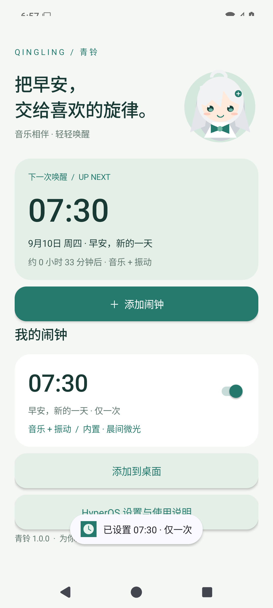
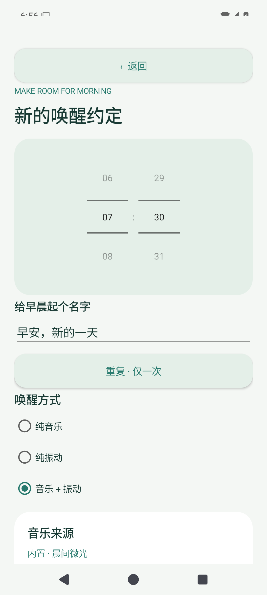
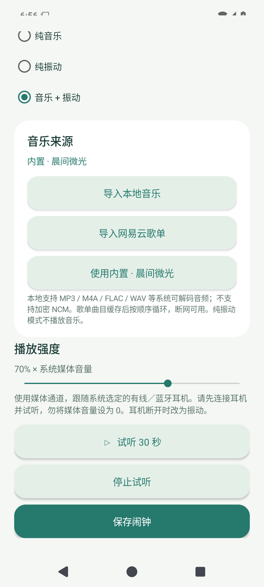

# 青铃 · Qingling

给 Xiaomi HyperOS 的音乐闹钟。银白、青绿与圆角卡片，搭配原创矢量小精灵，让早晨从喜欢的旋律开始。

**目标系统：Xiaomi HyperOS 3.0.10.0.VMICNXM / Android 15。** 应用最低支持 Android 8.0，使用 Android 15 SDK 构建。目标 HyperOS 真机的省电策略和耳机路由需按下方步骤验收，不能仅凭 Android 模拟器保证。

## 下载安装

在本仓库 [Releases](../../releases/latest) 下载 `Qingling-1.0.0.apk`，传到手机安装。`aab` 是用于分发平台的 Android App Bundle，不能直接点击安装。`SHA256SUMS.txt` 可用于校验下载文件。

首次安装后打开应用，允许通知，点击「HyperOS 设置与使用说明」完成精确闹钟、全屏提醒和后台权限设置。

## 已实现

  

桌面组件实机渲染（Android 15 模拟器）：[查看截图](docs/screenshots/widget.png)。已验证桌面添加、显示保存的闹钟、点击进入应用。

| 功能 | 行为 |
| --- | --- |
| 响铃方式 | 纯音乐、纯振动、音乐 + 振动 |
| 耳机播放 | `USAGE_MEDIA`，跟随系统媒体输出，包括有线耳机和蓝牙 A2DP；不强制扬声器外放 |
| 耳机断开 | 收到系统音频路由断开广播后停止音乐、改为振动，避免意外外放 |
| 本地导入 | 系统文件选择器，复制到应用内部存储并验证音频；支持设备可解码的 MP3、M4A、FLAC、WAV 等，单文件不超过 128 MiB |
| 网易云歌单 | 粘贴公开歌单链接或 ID，读取最多 500 条接口返回的曲目，选择 1–20 首缓存，按歌单顺序循环播放 |
| 离线播放 | 已导入的本地文件和已缓存的歌单曲目无需联网；删除原始文件不会影响副本 |
| 重复与恢复 | 一次性、按星期重复，重启、更新应用、修改时间／时区后恢复调度 |
| 锁屏提醒 | 前台媒体服务、闹钟通知、全屏响铃页；系统权限决定是否自动弹出 |
| 稍后提醒 | 5 分钟；普通闹铃 10 分钟自动停止，试听 30 秒自动停止 |
| 桌面小组件 | 下一次响铃日期、时间、模式、开启数量和其他开启时间；点击进入应用；支持系统固定小组件请求 |
| 故障兜底 | 导入音乐全部失效时播放内置原创铃声；音频不可用、媒体静音或通话占用时尝试振动 |

内置的「晨间微光」是项目自行合成的无歌词铃声。这里的“纯音乐模式”指只播放音频、不振动；是否有歌词取决于导入的歌曲。

## HyperOS 必做设置

1. 青铃内开启「允许精确闹钟」「允许通知与锁屏通知」「允许全屏提醒」。
2. 系统「应用管理 → 青铃」开启后台自启动，省电策略设为「无限制」。
3. 如果系统提供，开启「锁屏显示」「后台弹出界面」，并在最近任务里锁定青铃。
4. 耳机连接后在系统中选中正确的媒体输出。用媒体音量键调高音量，点击「试听 30 秒」确认。
5. 设置两分钟后的闹钟，返回桌面并锁屏，确认音乐／振动、锁屏通知及停止／稍后提醒均正常。

不同版本设置名称可能变化，应用内提供跳转与手动说明。无法使用小组件固定入口时，长按桌面 → 添加小部件 → Android 小部件 → 青铃。

**音频说明：** 播放强度是应用播放增益 × 系统媒体音量；不会擅自提高全局媒体音量。未连接耳机时，音乐会从系统选中的扬声器等设备播放。蓝牙未连接、通话、勿扰模式和厂商音频策略均可能影响输出。振动也受硬件能力及系统策略影响。

**调度边界：** 不支持关机闹钟。强行停止应用、撤销精确闹钟权限、系统阻止后台运行时无法保证响铃；强行停止后需重新打开。重启恢复时，10 分钟内错过的计划补响，更早的计划移至下次符合条件的时间。编辑或切换闹钟开关会取消该闹钟的稍后提醒。多个闹钟同时触发时，最后启动的闹钟接管当前播放。

## 网易云说明

只访问网易云公开歌单与官方外链音频地址，不要求账号，不收集 Cookie，不绕过登录、付费、VIP、地域、版权或加密限制。部分曲目可能无法播放，或者只能获得平台提供的试听版本。导入完成会列出失败曲目；全部失败时保留原铃声。

这是**公开歌单缓存播放**，不是网易云账号登录客户端，也不是后台操控网易云 App。歌单不会自动更新，需要重新导入。短链接请先在浏览器打开并复制完整的 `music.163.com/playlist?id=…` 链接。私有歌单、NCM 加密文件不支持；官方公开接口变动时，可改用本地音乐导入。

每首在线歌曲最多 80 MiB；单次读取最多 2 分钟，网络连接／读超时分别为 15／20 秒。缓存仅在本机供闹铃使用，不随仓库和安装包发布。可在使用说明中清理未使用的音乐副本。

## 构建与签名

需要 JDK 17、Android SDK Platform 35、Build Tools 35.0.0。项目使用 Gradle Wrapper 8.11.1 和 Android Gradle Plugin 8.9.2，无第三方运行时依赖。

```powershell
# 设置 JAVA_HOME，并配置 ANDROID_HOME，或创建 local.properties 指向 SDK。
.\gradlew.bat testDebugUnitTest lintRelease assembleRelease

# 首次生成自己的签名身份。已经有原签名时应恢复，不能重新生成。
.\tools\init-signing.ps1

# 生成签名 APK、AAB 与 SHA-256 校验文件到 dist/
.\tools\release.ps1
```

没有 `keystore.properties` 时 release 构建输出未签名 APK。`tools/init-signing.ps1` 将私钥和密码备份到 `%LOCALAPPDATA%\QinglingSigning`，并创建已被 Git 忽略的本机配置。**务必安全备份该目录，后续升级必须继续使用相同签名。不要提交或发布签名文件。** CI 只生成未签名构建，不含发布私钥。

内置音频可用 `node tools/generate-melody.cjs` 重新生成。

## 验证

```powershell
.\gradlew.bat testDebugUnitTest lintRelease assembleDebug assembleDebugAndroidTest

# 仅在可清空的 Android 15 测试设备上运行；测试使用独立的 900001+ 闹钟 ID。
adb install -r app/build/outputs/apk/debug/app-debug.apk
adb install -r app/build/outputs/apk/androidTest/debug/app-debug-androidTest.apk
adb shell appops set io.github.ming.alarm SCHEDULE_EXACT_ALARM allow
adb shell pm grant io.github.ming.alarm android.permission.POST_NOTIFICATIONS
adb shell am instrument -w io.github.ming.alarm.test/io.github.ming.alarm.SmokeInstrumentation
```

JVM 测试覆盖一天内／跨日调度、工作日与周循环、夏令时跳时／回拨、跨年、网易云输入解析。设备测试覆盖真实 `AlarmManager → BroadcastReceiver → ForegroundService` 触发、模式保存、旧触发拒绝、一次性禁用、稍后提醒、停止、内置铃声的媒体通道播放。

v1.0.0 发布前：10 项 JVM 测试通过，Android Lint 无问题；Android 15 / API 35 模拟器运行 19 项设备检查全部通过，包含本地导入和网易云实际下载／解码／播放（使用 `-e network true` 启用网络检查）。最终签名 release APK 已在该模拟器安装并打开。网络接口测试只代表当次结果；HyperOS 真机、实体耳机、蓝牙与厂商省电策略尚未实测。

HyperOS 真机验收清单见 [docs/DEVICE-TEST.md](docs/DEVICE-TEST.md)。

## 设计与隐私

视觉方向参考用户提供的 [Whom001x/-](https://github.com/Whom001x/-)：银发、青瞳、青绿色配饰和 Q 版气质。本项目没有复制参考仓库图片，角色由 `MascotView` 以 Canvas 原创绘制，应用图标为矢量钟表。

无广告、无统计 SDK、无自有服务端、无账号系统。闹钟和音乐保存在本机应用私有存储，卸载会清除。为支持重启后首次解锁前的闹铃，闹钟与导入音乐使用 Android 设备保护存储。只有用户主动读取／缓存网易云歌单时请求网络。
